# Architecture: extracting `@wdio/browserstack-service` from the WebdriverIO monorepo

> Deep-dive companion to [`EXTRACTION.md`](../EXTRACTION.md) (the cutover checklist) and
> [`TSC-PROPOSAL.md`](./TSC-PROPOSAL.md) (the governance ask).
> This document explains **how things work today**, **what changes**, **why we chose this
> approach over the alternatives**, and **how every form of communication works after the move**.

---

## 0. TL;DR

We are moving the **source code and release pipeline** of `@wdio/browserstack-service` out of the
`webdriverio/webdriverio` monorepo into a BrowserStack-owned repository, **while keeping the package
published under the exact same `@wdio/browserstack-service` name and `@wdio` npm scope**.

- **For users: nothing changes.** Same `npm i @wdio/browserstack-service`, same
  `services: ['browserstack']`, same docs.
- **For BrowserStack: independent releases.** No longer gated by WebdriverIO's lockstep,
  TSC-triggered release train.
- **The model is proven.** WebdriverIO already does this for `@wdio/visual-service` and
  `@wdio/electron-service`. We validated it end-to-end (standalone build + a real BrowserStack
  session that loaded the independently-built package via `services: ['browserstack']`).

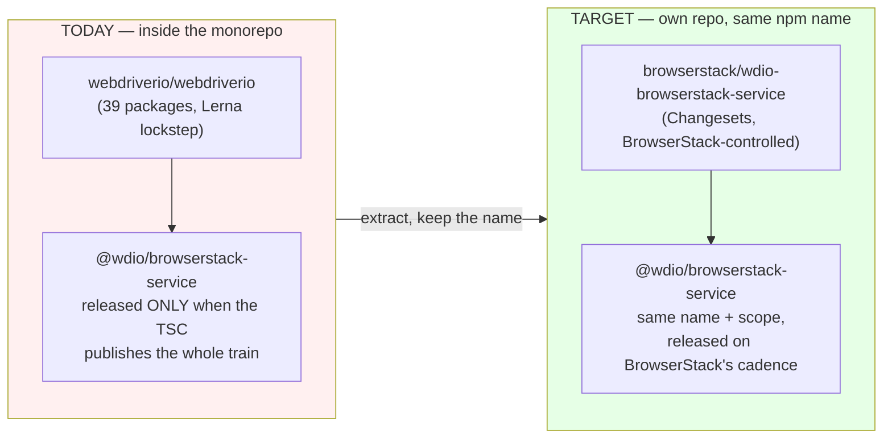

---

## 1. What the package actually is

`@wdio/browserstack-service` is the official WebdriverIO integration for BrowserStack. It is a
**WebdriverIO "service"** — a plugin that hooks into the test lifecycle. It bundles a large feature
set: Automate session management, the BrowserStack Local tunnel, Test Observability / TestHub,
Accessibility, AI self-healing, and Percy visual testing.

- npm: `@wdio/browserstack-service` — latest `9.27.2`, ~1M downloads/month, MIT, **ESM-only**, Node `>=18.20.0`.
- Two entrypoints: `.` (the service + launcher) and `./cleanup` (a standalone cleanup process).
- Today it lives at `packages/wdio-browserstack-service` in the monorepo. Its npm owners are
  WebdriverIO maintainers (not BrowserStack accounts) — BrowserStack contributes the logic and the
  `@browserstack/*` SDKs it depends on.

---

## 2. How things work TODAY (current architecture)

### 2.1 Where the code lives — the monorepo

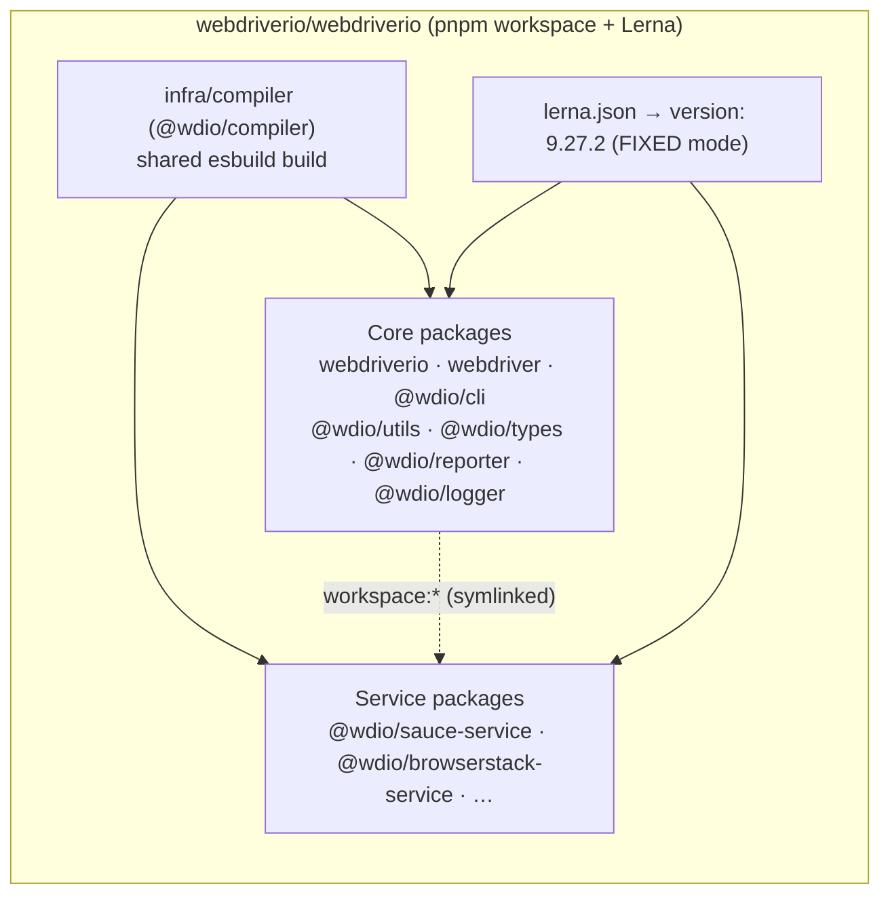

Key facts (all verified against the repo):
- **pnpm workspace + Lerna**, `packages/*`. Internal deps use the `workspace:*` protocol (symlinked
  locally; pinned to exact versions at publish time).
- **Lerna FIXED mode** — `lerna.json` has `"version": "9.27.2"` (not `"independent"`). Every package
  shares one version, bumped together.
- A shared **`@wdio/compiler`** (esbuild) builds every package; there is **no per-package build script**.

### 2.2 The build pipeline today

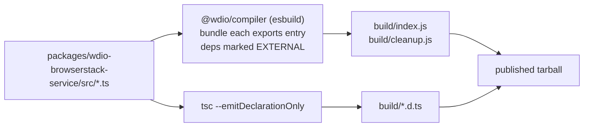

The compiler bundles only the package's own `src` (every dependency stays external) and `tsc`
emits the `.d.ts` files. This is driven centrally from the monorepo root.

### 2.3 The release pipeline today — lockstep, TSC-gated

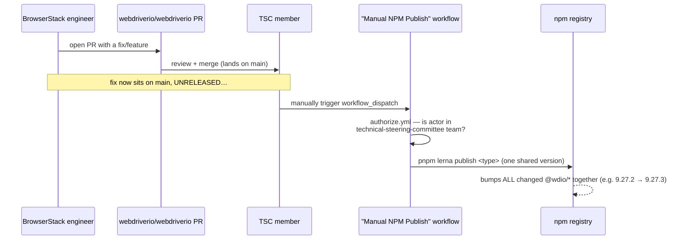

- The publish workflow is **`workflow_dispatch` only** and runs an `authorize` job that checks
  **`technical-steering-committee`** GitHub-team membership. BrowserStack cannot trigger it.
- One `lerna publish` bumps the **single shared version** for all changed packages.
- So a BrowserStack-only fix waits for the next TSC-run train, and ships under whatever the global
  version becomes. **This is the core pain.**

### 2.4 How users consume it (and the resolution mechanism)

A user writes this and never references a package path:

```js
// wdio.conf.js
export const config = {
  services: [['browserstack', { /* options */ }]]
}
```

WebdriverIO turns the shorthand `'browserstack'` into a real package via `initializePlugin()` in
`@wdio/utils`. **This is the single most important mechanism for "nothing changes for users":**

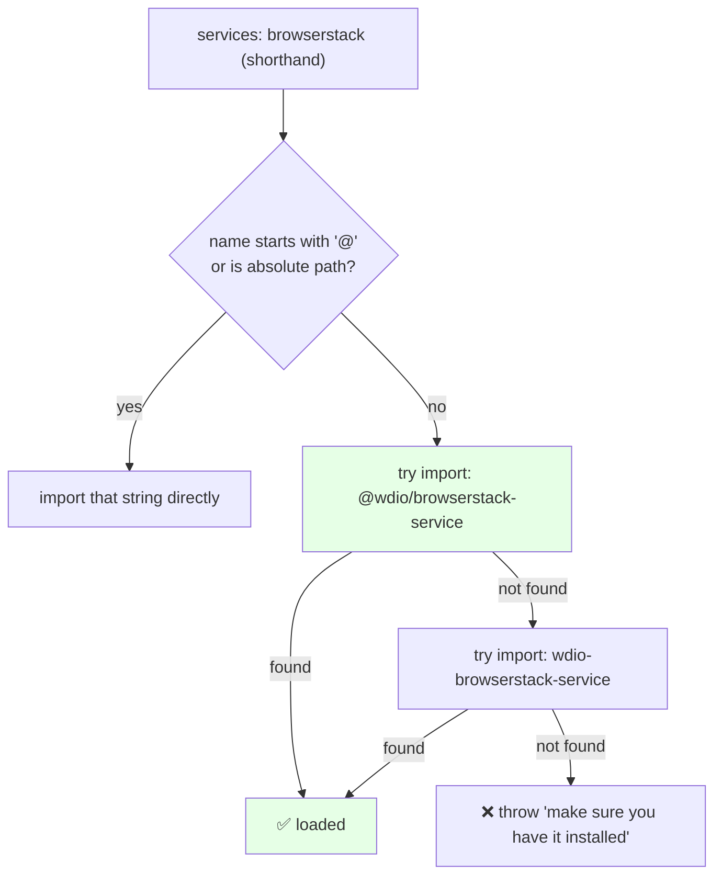

- It **`import()`s whatever is installed** — there is **no runtime auto-install**.
- The scoped name `@wdio/browserstack-service` is tried **first**.
- ⇒ As long as we keep publishing under `@wdio/browserstack-service`, the shorthand keeps resolving
  with **zero config or install changes**. (npm scopes can't be moved to another scope — which is
  exactly why we keep `@wdio`.)

### 2.5 Runtime communication today (three boundaries)

At runtime the service talks across three boundaries. **None of these change after the move.**

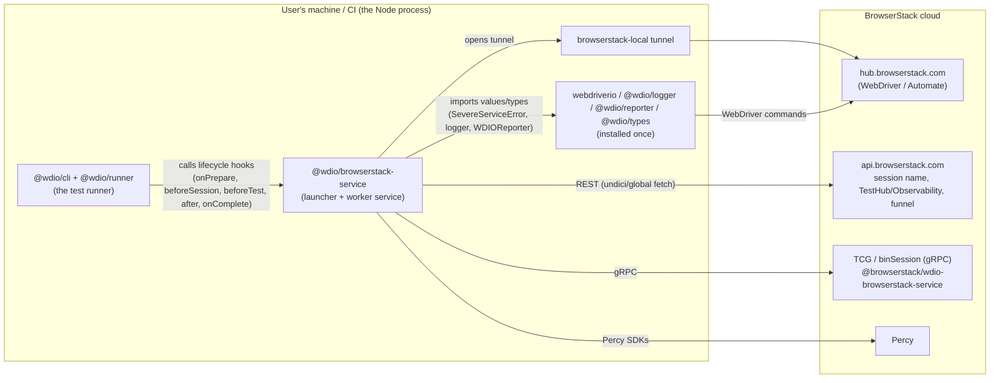

1. **Service ⇄ WebdriverIO core (in-process):** the runner (`@wdio/cli`/`@wdio/runner`) calls the
   service's lifecycle hooks. The service imports a few **values** from core — `SevereServiceError`
   from `webdriverio`, the default logger from `@wdio/logger`, `WDIOReporter` from `@wdio/reporter` —
   plus types from `@wdio/types`.
2. **Service ⇄ BrowserStack backend (network):** Automate via the WebDriver hub (driven by
   `webdriverio` core), plus REST calls (session name, Test Observability/TestHub, funnel
   instrumentation), gRPC (binSession via the `@browserstack/*` SDK), Percy, and the local tunnel.
3. **Service ⇄ user config:** options passed in `services: [['browserstack', {…}]]`.

### 2.6 Dependency graph today

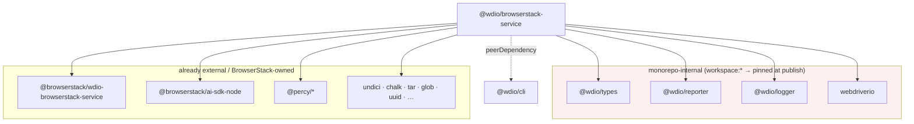

The four `@wdio/*` / `webdriverio` deps are the only thing tying the package to the monorepo.

---

## 3. The problem

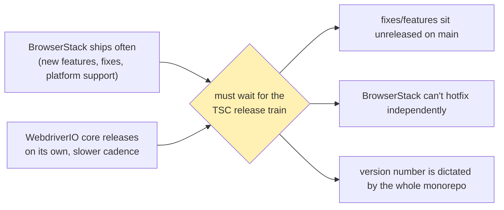

The release cadence mismatch is the entire motivation. Everything else (build, deps) is incidental
plumbing that exists only because the code lives in the monorepo.

---

## 4. What changes — and what explicitly does NOT

| Dimension | Today | After the move | User-visible? |
|---|---|---|---|
| **Install name** | `@wdio/browserstack-service` | **identical** | No |
| **`services: ['browserstack']`** | resolves to the package | **identical** | No |
| **npm scope/owner** | `@wdio` org | **`@wdio` org (unchanged)** | No |
| Source repo | `webdriverio/webdriverio` | `browserstack/wdio-browserstack-service` | No |
| Build | shared `@wdio/compiler` | local esbuild (`scripts/build.mjs`) + `tsc` | No |
| Versioning | Lerna fixed/lockstep | Changesets, independent | Only the version *number* line |
| Release trigger | TSC `workflow_dispatch` | BrowserStack CI on merge | No |
| `@wdio/*` core deps | `dependencies` (`workspace:*`) | **`peerDependencies` (`^9`)** + dev | No (dedupes) |

The one change with real engineering weight is the dependency reclassification:

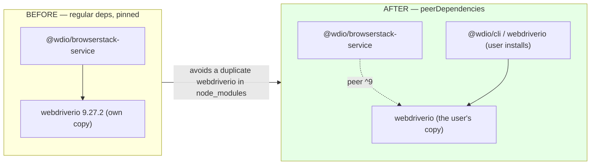

**Why this matters:** if `webdriverio`/`@wdio/logger`/`@wdio/reporter` were bundled as the service's
own dependency, the user would end up with **two copies** in `node_modules`. That breaks shared
singletons — `instanceof SevereServiceError` checks, the shared logger configuration, the reporter
event bus. Making them **peerDependencies** forces the service to use the **same instances** the user
already has installed. (We confirmed in the PoC that `webdriverio` deduped to a single copy.)

---

## 5. Options we considered, and why we chose this one

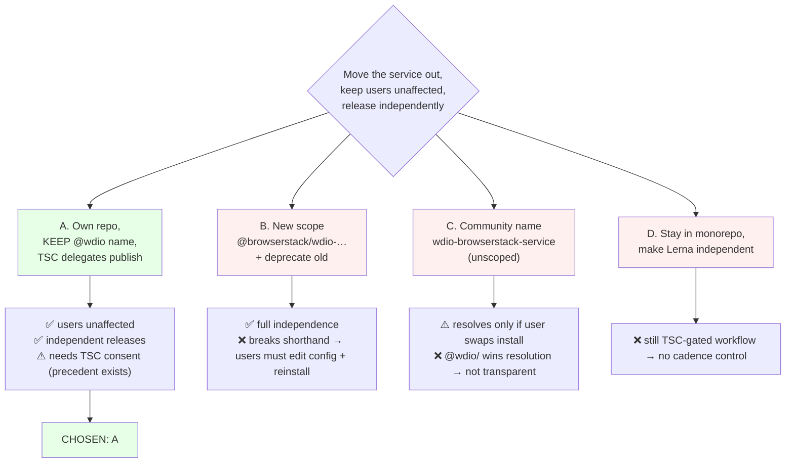

The decision is forced by a chain of hard constraints:

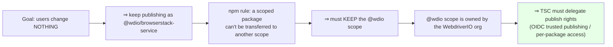

| Option | Users unaffected? | Independent cadence? | TSC needed? | Verdict |
|---|---|---|---|---|
| **A — own repo, keep `@wdio`, delegated publish** | ✅ | ✅ | yes | **Chosen** |
| B — new `@browserstack` scope + deprecate | ❌ (reinstall + config edit) | ✅ | no | Only if a one-time migration is acceptable |
| C — community unscoped `wdio-…` | ❌ (loses to `@wdio` in resolution) | ✅ | no | Not transparent |
| D — Lerna independent, stay in monorepo | ✅ | ❌ (still one TSC workflow) | yes | Doesn't solve the problem |

**Why A and not B:** B is the classic "rename + `npm deprecate`" playbook (Babel, ESLint, Storybook
addons). It works, but a new scope means `services: ['browserstack']` no longer resolves and every
user must edit `wdio.conf` and reinstall — a direct violation of the "nothing changes" requirement.
A keeps the identity and only moves the plumbing.

**Why A is safe:** it is the **exact** model WebdriverIO already runs for
[`@wdio/visual-service`](https://github.com/webdriverio/visual-testing) (own repo, Changesets,
independent version line) and [`@wdio/electron-service`](https://github.com/webdriverio/desktop-mobile).
Both publish under `@wdio` from repos outside the monorepo.

---

## 6. Target architecture

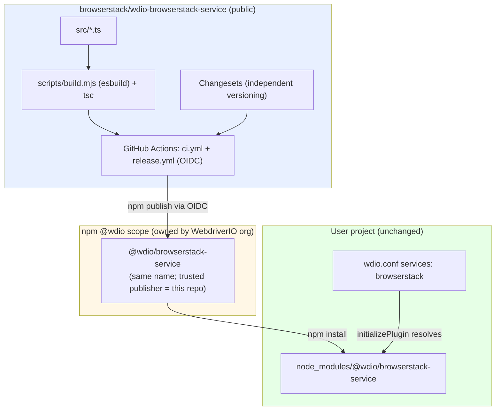

- **Repo:** BrowserStack-owned, public (provenance requires a public source repo and an exact
  `repository` URL match).
- **Versioning:** Changesets, independent line; compatibility expressed via peer ranges, not version
  parity.
- **Publishing:** npm **Trusted Publishing (OIDC)** — configured once by an `@wdio` org admin to point
  at this repo's `release.yml`. No long-lived npm token is shared with BrowserStack.

---

## 7. Communication model after the move (in depth)

"Communication" happens at four distinct layers. **Layer 1 (runtime) is the one users care about,
and it does not change at all.**

### 7.1 Runtime communication — UNCHANGED

The separately-published package integrates with WebdriverIO **identically** to today, because the
contract is *the npm package name + the service interface + shared peer packages* — none of which
depend on where the source lives.

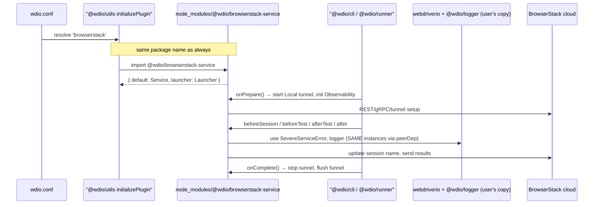

The **peerDependency** design is what makes "same instances" true: the service binds to the
`webdriverio`/`@wdio/logger`/`@wdio/reporter`/`@wdio/types` the user already installed, so there is no
duplicate-copy drift. This is communication **within one Node process** — repo location is irrelevant.

### 7.2 Build-time / compatibility communication — a one-way dependency on published `@wdio/*`

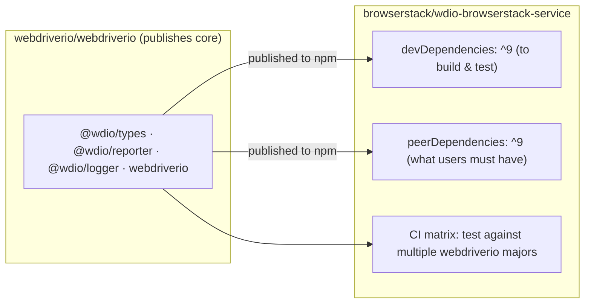

- The new repo consumes core packages **from npm** (as published by the monorepo) — a clean, one-way
  dependency. There is no reverse dependency: the monorepo never needs the service to build.
- **Compatibility is communicated through the peer range** (`^9.0.0`). When core ships a breaking
  major, BrowserStack widens/bumps the peer range and proves it with a CI matrix. This replaces the
  monorepo's implicit "everything is the same version" guarantee.

### 7.3 Release / publish communication — the OIDC handshake

Publishing under `@wdio` from a BrowserStack repo uses **OpenID Connect trusted publishing**. No
secret is shared; the npm registry verifies the GitHub-signed identity against a per-package config.

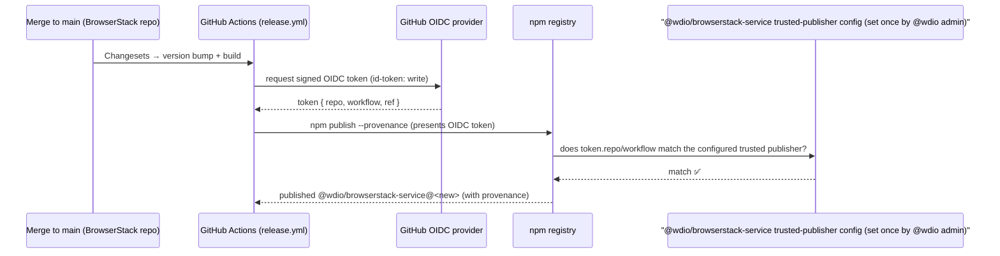

- **One-time setup (TSC/@wdio admin):** add a trusted publisher to the `@wdio/browserstack-service`
  package pointing at `browserstack/wdio-browserstack-service` + `release.yml`. (Alternative: grant a
  BrowserStack npm account per-package write access.)
- **Ongoing (BrowserStack):** every merge can publish autonomously — no human in the loop, no shared
  token, provenance attached.

### 7.4 Organizational communication — who talks to whom, and when

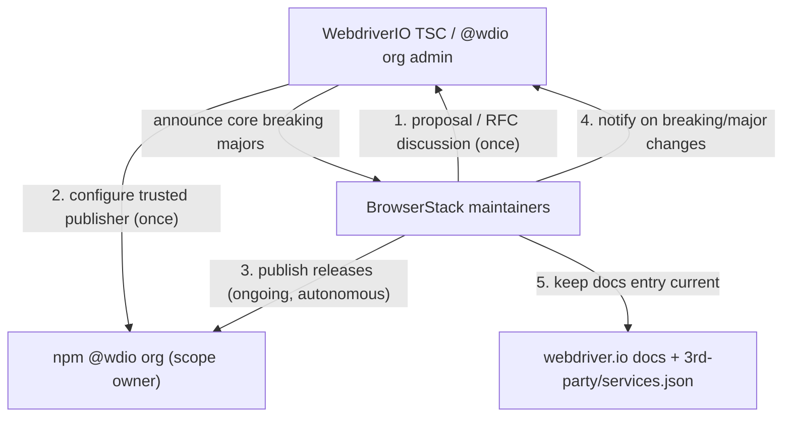

- **Once:** proposal + the trusted-publisher/access setup.
- **Ongoing & autonomous:** BrowserStack publishes whenever it wants.
- **Coordination only when needed:** core breaking majors (peer-range updates), docs changes, and
  security contacts. Day-to-day, the two projects are decoupled.

### 7.5 What happens on divergence / failure

| Scenario | How it's handled |
|---|---|
| Core ships a breaking major (e.g. v10) | BrowserStack updates the peer range + CI matrix, releases a compatible version on its own schedule. |
| A user pins an old service version | Works exactly as today — npm resolves the pinned version; the peer range guards compatibility. |
| BrowserStack needs an urgent hotfix | Merge + autonomous publish in minutes — no TSC dependency (the whole point). |
| TSC revokes/changes publish access | Releases pause until reconfigured; the already-published versions keep working for users. |
| Provenance/repo mismatch | Publish fails fast in CI (repo URL must match exactly); no bad artifact reaches users. |

---

## 8. What we validated (proof, not theory)

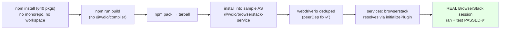

See [`EXTRACTION.md`](../EXTRACTION.md) for the detailed results, including the unit-test status
(every file passes in isolation; the all-at-once suite needs a teardown tweak owned by the team).

---

## 9. Risk register

| Risk | Likelihood | Mitigation |
|---|---|---|
| Duplicate `webdriverio` in user trees | Low | Core packages are `peerDependencies` (validated: deduped). |
| `services:['browserstack']` stops resolving | Very low | Never change the name/scope; integration-test the shorthand each release. |
| Service breaks on a new core major | Medium | CI matrix across `webdriverio` majors; peer range as the contract. |
| Provenance publish fails | Low | `repository` URL matches exactly; repo is public. |
| TSC won't delegate | Low | Strong precedent (visual/electron); fallback is Option B with a migration. |
| Version-number confusion (service vs core) | Low | Document independence; compatibility is the peer range, not the number. |

---

## 10. Glossary

- **Lerna fixed mode** — all monorepo packages share one version, bumped together.
- **`workspace:*`** — pnpm protocol that symlinks a sibling package locally; resolved to a concrete
  version at publish.
- **`initializePlugin`** — the `@wdio/utils` function that maps `services: ['x']` to a package by
  naming convention (`@wdio/x-service` then `wdio-x-service`), importing what's installed.
- **peerDependency** — a dependency the *consumer* must provide, so a single shared copy is used.
- **Trusted publishing (OIDC)** — publishing to npm using a short-lived, GitHub-signed identity instead
  of a long-lived token; configured per package.
- **Provenance** — a signed attestation linking a published artifact to the exact repo/commit/workflow
  that built it.
